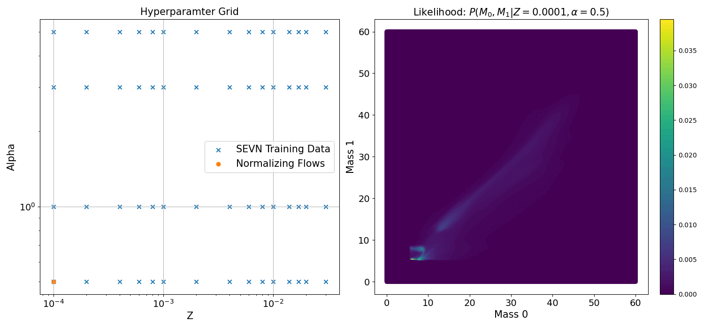
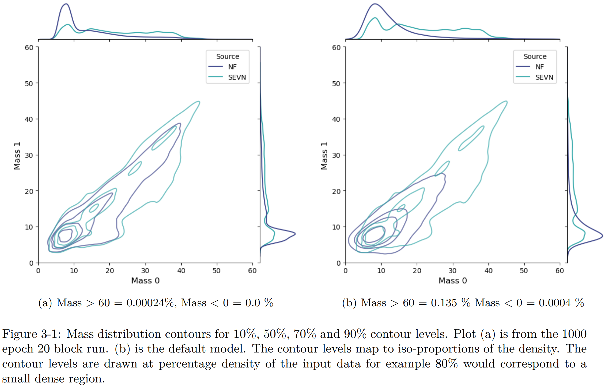
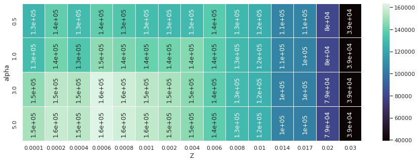

# Thesis: Physics of Data

I enjoy applying novel techniques to help overcome technical limitations and enable new science. This is in essence the heart of my [Master’s thesis](Thesis_Jackson_Jake.pdf). In which, the population synthesis code SEVN, can be emulated through the technique of Normalizing Flows. Normalizing Flows are a type of generative model that employs highly accurate and invertible distributions for sampling and density evaluation in an efficient manner. This was successfully applied to the SEVN generated binary black hole mergers and optimized in my thesis allowing for rapid sampling and hyperparameter likelihood estimation.  This project was a collaboration between the DEMOBLACK group, the University of Padova, and the University of Michigan.  

## Why do this?

* Normalizing Flows can  get a highly accurate estimation likelihood. SEVN has 1000s of inputs making it otherwise very difficult to isolate the likelihood of the parameters of interest.
* Rapid generation of samples 
* Simulations like SEVN use discrete hyperparameter grids, with NF we can get a accurate likelihood estimation interpolation for continuous hyperparameters values (see figure above).  
* This is very useful for Hierarchical Bayesian Analysis.
  
## Modifications & Opimizations
 
* Pipeline to make the normalized flows compatible with SEVN BHBH merger data

* Preprocessing: The SEVN BHBHm dataset was trimmed down to only M0, M1, Z and α. Since Z and α are both made up of a set repeating fixed values they were saved employing dictionary encoding. This almost eliminated the overhead of 1600000 numbers. The data was saved in Parquet files, the combined effect was that the input went from 237.9MB down to 11.4MB. This had a measurable effect on the training time.

* Data loader: The data set would not fit into local GPU RAM. A data loader was added which allows training in batches and lowered the overhead enough that CUDA could be used. This reduced training time by ∼ ×5. These optimizations enabled the subsequent hyperparameter tuning and deeper 1000 epoch training runs.

* Early stopping: The rate of loss change was monitored with a threshold to stop the model when it was not learning fast enough. This has the benefit of saving computation time and preventing over-training.

* Run information storage(in JSON): The training script was rewritten to store every variable in a dictionary including all user options from the argument parser(which was also altered to enable fully customizable runs).

* SBATCH submission script: This can automate the production and submission of SBATCH scripts on the cluster. This can be useful when running multiple training’s simultaneously on the cluster like in hyperparameter tuning.

## Key Plots:
#### Binary Black Hole Mass Distributions + Hyperparameter Tuning improvement

The plot of the left captures far more detail of the underlying distribution. A 1000 epoch run was made possible through a series of optimizations made during the project. 
<!--
#### Visualizing the training (set fixed hyperparamters for simplicity.)

Plotting the at a particular place.

<video src="https://github.com/jjackson1994/Thesis_Normalizing_Flows_for_Binary_Black_Holes/blob/main/images/NormalizingFlowsLikelihoodEstimation_1000_Epochs_BHBHm.mp4"></video>
 … -->
## DATASET: 

Data was from the [SEVN  Fiducial 5 million run](https://arxiv.org/abs/2211.11774). To run SEVN through Python see my [SEVN Python Wrapper Repo](https://github.com/jjackson1994/SEVN_PyWrapper).

### Methodology

The name of the Normalizing Flows (NF) generative model is comprised of two components. Normalizing as when transforming the distribution it needs to be normalized by a change of variables. Flows refer to the series of invertible transformations that make up the more complex transformations. In simple terms, a basic probability density is transformed into a complex target probability density. For instance, a simple  Gaussian $z \sim p_z$ to complex target probability density function $x \sim p_x$. This is done through the use of an invertible transformation easy to compute (i.e. tractable) Jacobian 

$$p_x(x)=p_z(g^{-1}(x))\left| \text{det} \frac{\partial g^{-1}(x)}{\partial x} \right|
$$

#### Loss function: Negative Log Likelihood 

$$\mathcal{L}=-\frac{1}{\left| \mathcal{D} \right|} \sum_{x \in \mathcal{D}} \log(p_x(x)) = -\frac{1}{\left| \mathcal{D} \right|} \sum_{x \in \mathcal{D}} \log\left(p_z(z)\left| \text{det} \frac{\partial z}{\partial x} \right|\right)\\ = -\frac{1}{\left| \mathcal{D} \right|} \sum_{x \in \mathcal{D}} \log\left(p_z(z) \right)+\log\left| \text{det} \frac{\partial z}{\partial x} \right|$$

Expanding the formula out as in the right hand side of equation 2.3 less us see that the metric is made up of
two key components the first base measure sample log likelihood and the second term, the log-determinant
or (volume correction), accounts for the change of volume induced by the transformation of the normalizing
flows. In training the flow parameters are adjusted in order to maximize the log likelihood (or reduce negative
log likelihood).

In this project uses the Masked Autoregressive Flow  MAF implementation. 

* Autoencoder with hidden layers
* To constrain the autoencoder to learn joint probability density function with conditional dependence.
* Agnostic to the ordering of input vector
* Dropping the connections that have no dependence (times zero vector)
* The Masks select which connections are dropped
* Model trained to learn the best transformations.
